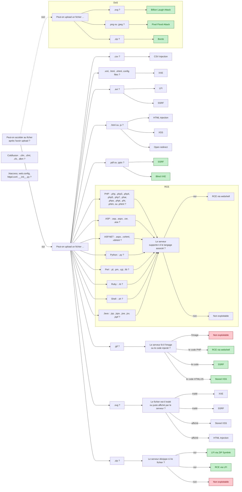

# Téléchargement non restreint de fichier

Unrestricted File Upload

## PHP

> Webshell / Remote Code Execution

## ASP

> Webshell / RCE

## SVG

> Stored XSS / SSRF / XXE?

## GIF

> Stored XSS / SSRF

## CSV

> CSV Injection

## XML

> XXE

## AVI

> LFI / SSRF

## HTML / JS

> HTML injection / XSS / Open redirect

## PNG / JPEG

> Pixel Flood Attack

## ZIP

> RCE via LFI / Dos / Symlink

En un mot, les cybercriminels peuvent créer des archives Zip pour lancer des attaques par traversée de chemin afin d’écraser des fichiers importants sur les systèmes affectés, soit en les détruisant, soit en les remplaçant par d’autres fichiers malveillants.

## PDF / PPTX

> RCE via LFI

## Link

[Unrestricted File Upload | OWASP](https://owasp.org/www-community/vulnerabilities/Unrestricted_File_Upload)

[Top 10 - What can you reach in case you uploaded... | Twitter, Salah Hasoneh](https://twitter.com/SalahHasoneh1/status/1281274120395685889?s=20)

https://vulp3cula.gitbook.io/hackers-grimoire/exploitation/web-application/file-upload-bypass

[Media type - Wikipedia](https://en.wikipedia.org/wiki/Media_type#Type_application)

https://book.hacktricks.xyz/pentesting-web/file-upload

http://repository.root-me.org/Exploitation%20-%20Web/EN%20-%20Webshells%20In%20PHP,%20ASP,%20JSP,%20Perl,%20And%20ColdFusion.pdf

